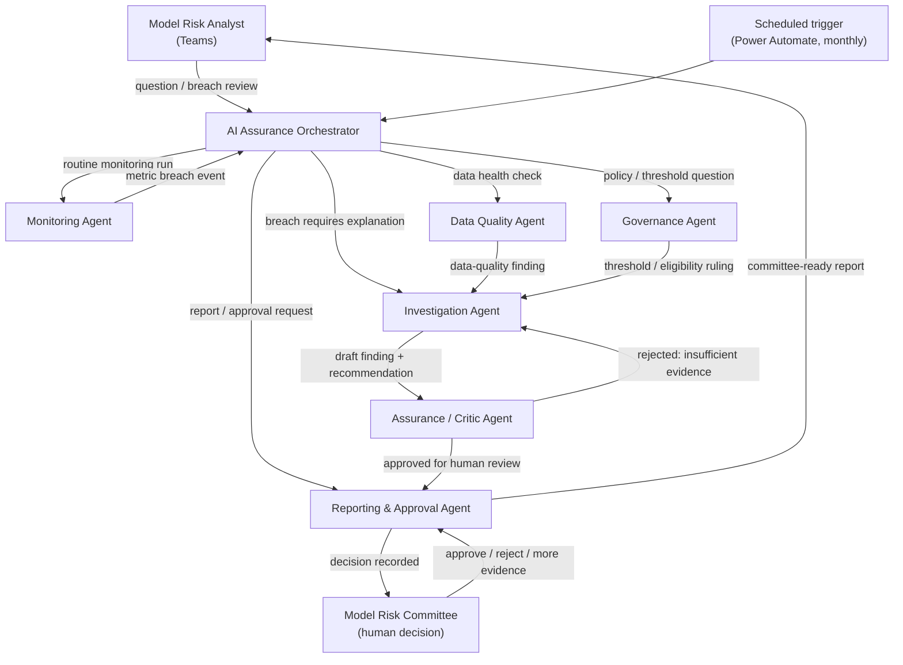

# Agent Architecture — Design Principles and Topology

**Audience:** architects, Copilot Studio builders, Model Risk Committee.
**Depends on:** `data/TEMPORAL_MODEL.md`, `agents/*.md`, `policies/AGENT_RISK_POLICY.md`.

## 1. Non-negotiable design principles (Part 1)

Each principle below is binding on every agent and tool built for this project. "Failure prevented" describes what goes wrong in a real deployment if the principle is dropped — these are not style preferences.

### 1.1 Deterministic calculations separated from LLM reasoning

**Statement.** Every number that appears in a monitoring report, investigation, or committee pack (PSI, Gini, bad rate, population count, RAG status) is computed by a versioned, testable, non-LLM pipeline (SQL / Fabric notebook / Azure Function) and written to the monitoring mart. Agents *read* these numbers through a tool call; they never derive them by reasoning over raw rows in a prompt.

**Failure prevented.** LLMs are not reliable arithmetic engines and cannot be trusted to compute PSI across 40,000 rows correctly, consistently, or reproducibly. Without this separation, two runs of the same investigation could produce two different PSI values with no way to tell which is correct — which is fatal in a model risk context where a regulator can ask "how was this number calculated" and expects a deterministic, re-runnable answer.

### 1.2 Event-time versus processing-time separation

**Statement.** Every fact table carries both an event-time field (when the thing happened) and a processing-time field (when AI Assurance ingested/computed it). Metrics are always computed as-of an event-time cut, never a processing-time cut.

**Failure prevented.** Without this, late-arriving bureau data landing on the 5th of the month but dated for the 1st would silently change "May's" numbers after May's report has already gone to committee, with no way to explain the discrepancy. This is the single most common cause of "the numbers don't match last month's report" incidents in monitoring platforms.

### 1.3 Observation-window and performance-window separation

**Statement.** Feature/score observation date and the forward performance window used to build a label are always distinct fields, never derived implicitly from "today."

**Failure prevented.** Conflating the two is the direct mechanism of target leakage — a feature computed using information from inside the performance window will show artificially strong predictive power in backtesting and fail in production. See `data/TEMPORAL_MODEL.md` for the enforcement rule (`feature_observation_date < performance_window_start` is a hard constraint, checked by the Data Quality Agent).

### 1.4 Evidence-grounded conclusions

**Statement.** Every finding, root cause, or recommendation produced by an agent must cite one or more evidence-ledger rows (`fact_evidence_item`), each of which in turn cites a table, row identifier, or tool call. A conclusion with no evidence citation is rejected by the Assurance/Critic Agent by construction (see `agents/ASSURANCE_AGENT.md`).

**Failure prevented.** Ungrounded LLM narrative ("the drift is likely due to seasonality") is exactly the failure mode that makes model risk teams distrust AI tooling. Requiring citation forces the Investigation Agent to actually query evidence rather than pattern-match plausible-sounding explanations.

### 1.5 Policy-as-code

**Statement.** Thresholds, RAG bands, escalation rules and eligibility rules (e.g., MOB ≥ 6) live as structured, versioned rows in `dim_governance_threshold` and `dim_policy_clause` — never hardcoded in an agent prompt or in application code.

**Failure prevented.** If a threshold is embedded in a prompt string, changing it requires a prompt edit and redeployment with no audit trail of who changed a risk threshold and why. Policy-as-code means a threshold change is a data change with its own effective date, approver and version — auditable exactly like a model change.

### 1.6 Versioning and lineage

**Statement.** Every model, feature set, prompt, policy document, threshold set and knowledge source has an explicit version. Every score event and metric value records which versions produced it.

**Failure prevented.** Without versioning, "the Behaviour Score" is ambiguous — is this v2.1 scored with feature set v14, or v2.0 with feature set v13? A monitoring breach investigated against the wrong model version produces a wrong root cause. See `scenarios/SCENARIO-004-wrong-model-version.md`.

### 1.7 Human accountability

**Statement.** No investigation closes and no recommendation is actioned without a named human decision-maker recorded in `fact_committee_decision` or `fact_human_approval`.

**Failure prevented.** Diffusion of responsibility — "the AI decided" is not an acceptable governance answer. Naming a human accountable owner for every closure keeps AI Assurance a decision-support system, not a decision-making one, which is also the regulatory posture required for model risk tooling.

### 1.8 Least privilege

**Statement.** Each agent has a named, minimal set of data domains and tools it may access (see each agent contract's "Allowed data domains" / "Prohibited data access" sections). The Reporting Agent, for example, cannot query raw customer PII; it can only read already-approved committee-ready aggregates.

**Failure prevented.** A single over-privileged agent is a single point of both accidental data exposure and prompt-injection blast radius. Scoping access per agent means a compromised or confused agent cannot wander into bureau or PII tables it has no business reason to touch.

### 1.9 Agent auditability

**Statement.** Every agent invocation, tool call, and hand-off is logged to `fact_agent_execution_log` and `fact_tool_execution_log` with input, output, timestamp, model/prompt version, and correlation ID.

**Failure prevented.** Without execution logs, "why did the Investigation Agent conclude X" is unanswerable after the fact — which fails any audit or regulatory review of an AI-assisted governance process.

### 1.10 No direct customer-impacting action by agents

**Statement.** No agent in this system can change a credit limit, decline an application, place a collections treatment, or take any action that reaches a customer or account. Agents write to investigation, evidence, finding, recommendation and report tables only.

**Failure prevented.** This is the hard boundary that keeps AI Assurance a monitoring/governance tool rather than an autonomous credit-decisioning system, which would trigger an entirely different (and far heavier) regulatory regime. It also removes an entire class of catastrophic failure: a hallucinated or manipulated agent output can produce a wrong *report*, never a wrong *customer action*.

### 1.11 Product-specific extensions under a common semantic model

**Statement.** Credit Card, Speedy Cash and Speedy Loan share one account, snapshot, and score-event backbone. Product-specific mechanics (utilization/limit for revolving; amortization/tenor for term loans) live in extension tables joined 1:1 to the parent grain, never as a sprawling set of nullable columns on one mega-table.

**Failure prevented.** A single flat table with `utilization_pct` sitting next to `remaining_tenor_months` (nullable for whichever product it doesn't apply to) is the schema failure mode that made the previous design "too simplistic": it cannot express "this field is *not applicable*" versus "this field is *missing*," it invites incorrect joins, and it makes every downstream query product-aware by accident rather than by design. See `adr/ADR-009-mvp-product-model.md`.

## 2. Agent topology

## 3. Critic loop (mandatory)

No Investigation Agent output reaches a human unreviewed. The Assurance/Critic Agent independently re-checks: (a) every claim has a cited evidence row, (b) evidence dates are within the applicable performance window, (c) the root cause taxonomy code exists and is not contradicted by a higher-severity counter-evidence item, (d) the model version referenced matches the model version that actually produced the breached metric. A rejection sends the investigation back to the Investigation Agent with the specific gap named — never a silent retry.

## 4. Failure containment boundary

Everything left of the dashed line in the topology diagram operates on the monitoring mart and governance schema only — read/write to `fact_investigation`, `fact_evidence_item`, `fact_finding`, `fact_recommendation`. Nothing in this system has a path to `dim_account`, scoring engines, or any production credit system with write intent. This boundary is enforced at three layers: Entra ID role scoping (`architecture/SECURITY_ARCHITECTURE.md`), Copilot Studio connector permissions (`architecture/SYSTEM_ARCHITECTURE.md`), and code-level assertions in every tool (`tools/ERROR_HANDLING.md`).
