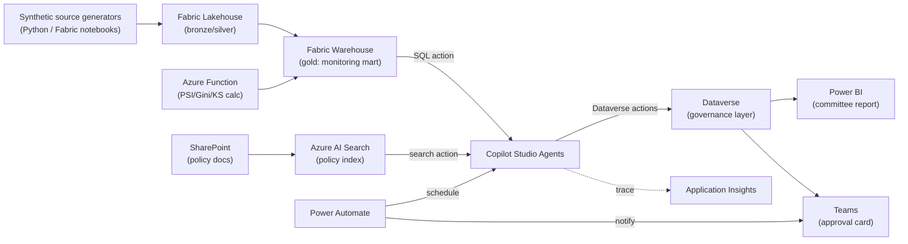

# System Architecture — Microsoft Component Mapping (Part 8)

**Audience:** Copilot Studio Solution Architect, enterprise architecture review board.
**Rule applied throughout:** a component appears here only if a named agent or flow genuinely needs it in MVP or a clearly justified enterprise increment. No component is included to "look sophisticated."

## 1. Component-by-component specification

| Component | Purpose | Data stored | Actions exposed | Agent(s) that use it | MVP or future | Complexity |
|---|---|---|---|---|---|---|
| **Copilot Studio** | Hosts all seven agents as connected topics/agents; owns conversation orchestration and tool-calling | No persistent business data — conversation state only | Agent invocation, tool (action) calls, hand-off between agents | All | MVP | Medium — this is the core build effort |
| **Connected agents (Copilot Studio)** | Lets the Orchestrator hand off to specialist agents as first-class connected agents rather than one monolithic prompt | None | Hand-off with context payload | Orchestrator → all specialists | MVP | Medium |
| **Power Automate** | Scheduled trigger for the monthly monitoring run; notification flow (Teams post) when an investigation opens or a committee decision is recorded | Flow run history (platform-native) | `Run monitoring cycle`, `Notify Teams channel`, `Write committee decision to Dataverse` | Triggers Monitoring Agent; used by Reporting & Approval Agent | MVP | Low |
| **Teams** | Human interface: analyst chats with Orchestrator; committee approval card posted for decision | None (transient UI) | Adaptive Card approval action, chat | Human ↔ Orchestrator, Human ↔ Reporting & Approval Agent | MVP | Low |
| **Dataverse** | System of record for governance-layer, human-facing entities: investigations, evidence, findings, recommendations, committee decisions, agent execution logs. Chosen over Fabric Warehouse for this layer because Copilot Studio's native low-code actions and Power Automate connectors are first-class against Dataverse, and because row-level security maps directly to least-privilege requirements here | `fact_investigation`, `fact_evidence_item`, `fact_finding`, `fact_recommendation`, `fact_committee_decision`, `fact_human_approval`, `fact_agent_execution_log`, `fact_tool_execution_log`, `dim_agent`, `dim_policy_document`, `dim_policy_clause`, `dim_governance_threshold` | CRUD via Copilot Studio native Dataverse actions and Power Automate | All agents (governance layer read/write) | MVP | Medium |
| **Fabric Lakehouse** | Bronze/silver landing and curation for synthetic source data (applications, snapshots, bureau, repayments) before it becomes monitoring-ready | `fact_application`, `dim_account` (+ extensions), `fact_account_snapshot_monthly` (+ extensions), `fact_repayment_transaction`, `fact_bureau_tradeline`, `fact_bureau_aggregate_monthly` | Notebook-based synthetic data generation and curation jobs | Feeds Fabric Warehouse (no agent touches the Lakehouse directly) | MVP | Medium |
| **Fabric Warehouse** | Gold-layer monitoring data mart — deterministic metric tables agents read through tools. This is the enforcement point for Principle 1.1 (deterministic calculation separation) | `fact_model_score_event`, `fact_performance_label`, `fact_monitoring_metric`, `fact_segment_monitoring_metric`, `fact_data_quality_check`, `dim_model`, `dim_model_version`, `fact_model_deployment`, `dim_feature_definition`, `fact_feature_lineage` | Read via SQL action from Copilot Studio / Azure Function wrapper | Monitoring Agent, Data Quality Agent, Investigation Agent (read-only) | MVP | Medium–High — this is the second major build effort after agent design |
| **SharePoint** | Document store for policy documents (PDF/Word) referenced by `dim_policy_document`; source library for governance text the Governance Agent grounds against | Policy PDFs, threshold matrix workbook (source-of-truth copy) | File read via Azure AI Search index (below), not direct agent browsing | Governance Agent (indirectly, via search index) | MVP | Low |
| **Power BI** | Committee report visual layer and monitoring dashboards; embeds into the Reporting & Approval Agent's output and into Teams | Report definitions only; queries Fabric Warehouse / Dataverse live | Report embed, drill-through | Reporting & Approval Agent (generates narrative that accompanies the report); humans consume directly | MVP | Low–Medium |
| **Azure Functions / API** | Thin wrapper around statistical calculations that are awkward to express as pure SQL (PSI/CSI binning, Gini/AUC/KS, Brier score) and around the deterministic metric-write step | Stateless — reads Fabric Warehouse, writes `fact_monitoring_metric` | `calculate_metric`, `write_metric_result` | Called by the scheduled monitoring pipeline, not directly by agents | MVP | Medium |
| **Azure AI Search** | Vector + keyword index over policy documents and the root-cause taxonomy so the Governance and Investigation Agents can ground citations against actual clause text instead of hallucinating policy language | Chunked, embedded policy text; index only, source remains SharePoint | `search_policy_clauses` | Governance Agent, Investigation Agent (citation grounding) | MVP — deliberately included, this is the one RAG component genuinely needed to satisfy Principle 1.4 (evidence-grounded conclusions) for policy citations specifically | Medium |
| **Entra ID** | Identity and least-privilege enforcement for every agent's Dataverse/Fabric connection, using per-agent service principals mapped to security roles | Identity/role assignments (platform-native) | Auth for every connector | All (platform layer, not a callable tool) | MVP | Low (configuration, not build) |
| **Purview** | Data catalog and lineage for the full estate (Lakehouse → Warehouse → Dataverse), sensitivity labeling enforcement | Lineage graph, sensitivity labels | Lineage query (manual review in MVP, not agent-callable) | None directly in MVP; enterprise: Governance Agent could query lineage | **Future** — MVP relies on documented lineage in `data/TABLE_CATALOG.md`; Purview automation is an enterprise increment, not needed to prove the MVP narrative | Medium (licensing + config) |
| **Application Insights** | Distributed tracing across agent → tool → Dataverse/Warehouse calls, correlated by `correlation_id` | Trace spans, exceptions | Query via Log Analytics (manual review in MVP) | None directly; supports `architecture/OBSERVABILITY.md` | MVP for logging, **future** for automated alerting on trace anomalies | Low–Medium |

## 2. What was deliberately left out and why

- **Azure OpenAI fine-tuning / custom models** — Copilot Studio's built-in generative orchestration is sufficient; there is no MVP task that requires a custom-trained LLM.
- **Cosmos DB** — no component in this design needs multi-region, low-latency document storage; Dataverse and Fabric Warehouse cover every grain required.
- **Synapse** — superseded by Fabric for this build; listing both would be redundant infrastructure.
- **Separate vector database (e.g., standalone Pinecone/Weaviate)** — Azure AI Search already provides vector + keyword hybrid search natively integrated with Copilot Studio; adding a second vector store would be pure architecture theatre.
- **Automated remediation execution engine** — out of scope by design (Principle 1.10); remediation actions are *recorded*, not *executed*, so no orchestration engine for customer-impacting actions exists in this system at all, MVP or enterprise.

## 3. Data flow summary

## 4. Environments

| Environment | Purpose | Data |
|---|---|---|
| Dev | Agent/tool build and iteration | Small synthetic sample (≈ 2,000 accounts) |
| Demo/UAT | SAS Innovate and internal demo | Full synthetic dataset per `data/SYNTHETIC_DATA_SPEC.md` (≈ 25,000 accounts, 24 months history) |
| Production (enterprise target, not built in MVP) | Live monitoring | Real curated data, subject to full Purview/Entra controls |
