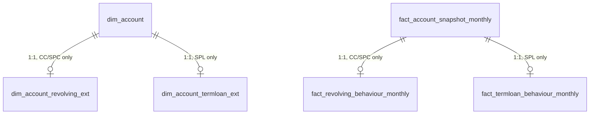

# Domain Model (Part 2 Overview)

**Audience:** data architects, Copilot Studio builders needing conceptual orientation before reading `TABLE_CATALOG.md`.
**Full detail:** `TABLE_CATALOG.md` (every table, every field). This file explains the *shape* of the model and the extension pattern; it does not repeat field-level detail.

## 1. The 32 domains, grouped into five layers

The brief's 32 domains map to **five architectural layers**. This grouping is what makes the model tractable — each layer has one grain philosophy and one set of temporal rules.

### Layer A — Source-of-truth entities (domains 1–3)
Customer, application, and account/product master. Low change frequency, SCD2 where history matters.

| # | Domain | Table(s) |
|---|---|---|
| 1 | Customer and demographics | `dim_customer` |
| 2 | Application and acquisition | `fact_application` |
| 3 | Product and account master | `dim_account` (parent) + `dim_account_revolving_ext` + `dim_account_termloan_ext` |

### Layer B — Behavioural time series (domains 4–10)
Everything that changes monthly or transactionally. This is the largest layer by row volume.

| # | Domain | Table(s) |
|---|---|---|
| 4 | Monthly account snapshots | `fact_account_snapshot_monthly` (parent) |
| 5 | Revolving credit behaviour | `fact_revolving_behaviour_monthly` (CC, SPC extension) |
| 6 | Term-loan behaviour | `fact_termloan_behaviour_monthly` (SPL extension) |
| 7 | Repayment history | `fact_repayment_transaction` |
| 8 | Delinquency and collections state | `fact_delinquency_state_monthly` |
| 9 | Bureau tradelines | `fact_bureau_tradeline` |
| 10 | Bureau aggregates | `fact_bureau_aggregate_monthly` |

### Layer C — Model and scoring (domains 11–16)
Model registry, features, score events, labels, and metrics — the analytical spine.

| # | Domain | Table(s) |
|---|---|---|
| 11 | Model inventory and lifecycle | `dim_model` |
| 12 | Model versions and deployments | `dim_model_version`, `fact_model_deployment` |
| 13 | Feature definitions and lineage | `dim_feature_definition`, `fact_feature_lineage` |
| 14 | Model score events | `fact_model_score_event` |
| 15 | Performance-label construction | `fact_performance_label` |
| 16 | Monitoring metrics | `fact_monitoring_metric` |

### Layer D — Governance and monitoring surface (domains 17–20)
Segment/DQ monitoring and the policy layer that interprets metrics.

| # | Domain | Table(s) |
|---|---|---|
| 17 | Segment monitoring | `dim_monitoring_segment`, `fact_segment_monitoring_metric` |
| 18 | Data-quality monitoring | `fact_data_quality_check` |
| 19 | Governance thresholds | `dim_governance_threshold` |
| 20 | Policy documents and clauses | `dim_policy_document`, `dim_policy_clause` |

### Layer E — Investigation, evidence and human decision (domains 21–32)
The agent-facing, human-approval layer. Lives in Dataverse (see `architecture/DATA_ARCHITECTURE.md`).

| # | Domain | Table(s) |
|---|---|---|
| 21 | Investigations | `fact_investigation` |
| 22 | Evidence ledger | `fact_evidence_item`, `fact_finding_evidence_link` |
| 23 | Findings and root causes | `fact_finding`, `dim_root_cause_taxonomy`, `fact_finding_contributing_factor` |
| 24 | Recommendations | `fact_recommendation` |
| 25 | Human approvals and committee decisions | `fact_committee_decision`, `fact_human_approval` |
| 26 | Remediation actions | `fact_remediation_action` |
| 27 | Agent inventory | `dim_agent` |
| 28 | Agent execution logs | `fact_agent_execution_log` |
| 29 | Tool execution logs | `fact_tool_execution_log` |
| 30 | Prompt and instruction versions | `dim_prompt_version` |
| 31 | Knowledge-source versions | `dim_knowledge_source_version` |
| 32 | Agent evaluations and override monitoring | `fact_agent_evaluation`, `fact_agent_override` |

Total physical tables: **45** (32 domains, several spawning 2–3 tables under the extension/bridge pattern; several domains sharing a bridge table).

## 2. The extension pattern, illustrated

A Credit Card account has exactly one row in `dim_account` and exactly one row in `dim_account_revolving_ext`, and **zero rows** in `dim_account_termloan_ext` — not a row with null tenor fields. The same pattern repeats at the monthly snapshot grain. See `adr/ADR-009-mvp-product-model.md` for the reasoning and rejected alternatives.

## 3. The model-family pattern (different from the product pattern)

A/B/C Score do **not** get separate score-event tables. `fact_model_score_event` and `fact_performance_label` share one grain (`model_id` + `account_id` + `score_date` / `observation_date`) across all three families, because the difference between A/B/C is a difference in *when the row exists and what populates certain fields*, not a difference in *what the row means*. The distinguishing fields:

| Field | A Score | B Score | C Score |
|---|---|---|---|
| `observation_date` basis | `application_date` | monthly snapshot date | delinquency-bucket observation date |
| `mob_at_observation` | typically null/0 (pre-booking) | required, must be ≥ 6 | required, any MOB |
| `delinquency_bucket_id` | null | null | required |
| Eligible population filter | applications only | `mob >= 6 AND account_status = 'active'` | `delinquency_bucket_id = target bucket` |

This is enforced by a Data Quality Agent rule set (`data/DATA_QUALITY_RULES.md`, rule `DQ-014`), not by physical schema separation — see `architecture/DATA_ARCHITECTURE.md` §3 for why this is the correct exception to the extension pattern.

## 4. Grain summary (quick reference — full grain statements are in TABLE_CATALOG.md)

| Table | Grain |
|---|---|
| `dim_customer` | one row per customer per SCD2 version |
| `fact_application` | one row per application |
| `dim_account` | one row per account per SCD2 version |
| `fact_account_snapshot_monthly` | one row per account per snapshot month |
| `fact_repayment_transaction` | one row per repayment transaction |
| `fact_delinquency_state_monthly` | one row per account per snapshot month |
| `fact_bureau_tradeline` | one row per bureau-reported tradeline per pull date |
| `fact_model_score_event` | one row per model version + account + score date |
| `fact_performance_label` | one row per model version + account + score date + performance window |
| `fact_monitoring_metric` | one row per model version + metric + calculation run + reference/current population pair |
| `fact_investigation` | one row per investigation |
| `fact_evidence_item` | one row per discrete evidence fact |
| `fact_agent_execution_log` | one row per agent invocation |

Full field-level specification, keys, SCD type, retention, sensitivity, example rows and downstream agent consumers for every table: **`TABLE_CATALOG.md`**.
