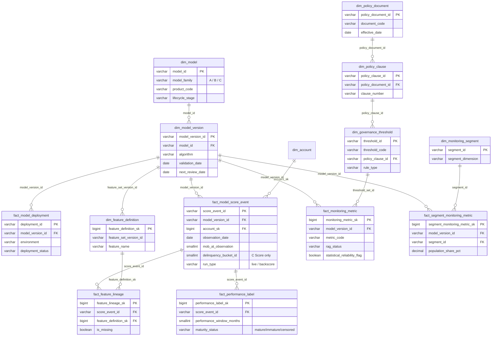
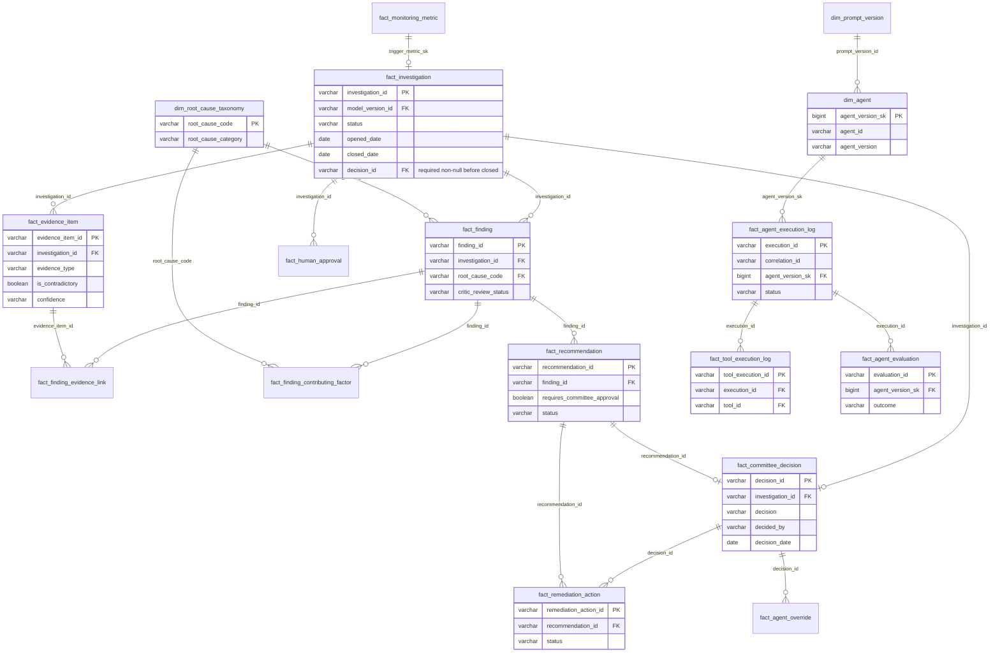

# ERD (Part 3 of Final Output — Mermaid)

**Audience:** everyone; this is the visual companion to `TABLE_CATALOG.md`. Split into three diagrams because a single 45-table ERD is unreadable — each diagram is complete within its layer, with explicit cross-layer join keys called out below.

## 1. Layer A + B — Customer, account, behaviour (source-of-truth + time series)

```mermaid
erDiagram
    dim_customer ||--o{ fact_application : "customer_sk"
    dim_customer ||--o{ dim_account : "customer_sk"
    fact_application ||--o| dim_account : "application_id (booking)"
    dim_account ||--o| dim_account_revolving_ext : "account_sk (CC/SPC only)"
    dim_account ||--o| dim_account_termloan_ext : "account_sk (SPL only)"
    dim_account ||--o{ fact_account_snapshot_monthly : "account_sk"
    fact_account_snapshot_monthly ||--o| fact_revolving_behaviour_monthly : "account_snapshot_sk (revolving)"
    fact_account_snapshot_monthly ||--o| fact_termloan_behaviour_monthly : "account_snapshot_sk (term loan)"
    dim_account_termloan_ext ||--o{ fact_termloan_behaviour_monthly : "account_termloan_ext_sk"
    dim_account ||--o{ fact_repayment_transaction : "account_sk"
    fact_account_snapshot_monthly ||--o| fact_delinquency_state_monthly : "account_snapshot_sk"
    dim_customer ||--o{ fact_bureau_tradeline : "customer_sk"
    dim_customer ||--o{ fact_bureau_aggregate_monthly : "customer_sk"

    dim_customer {
        bigint customer_sk PK
        varchar customer_id NK
        varchar income_band
        boolean is_current
    }
    fact_application {
        varchar application_id PK
        bigint customer_sk FK
        varchar product_code
        date application_date "A Score obs point"
        date booking_date
    }
    dim_account {
        bigint account_sk PK
        varchar account_id NK
        bigint customer_sk FK
        varchar product_code
        varchar product_family
        date booking_date "MOB=0 basis"
    }
    dim_account_revolving_ext {
        bigint account_revolving_ext_sk PK
        bigint account_sk FK
        decimal current_credit_limit
    }
    dim_account_termloan_ext {
        bigint account_termloan_ext_sk PK
        bigint account_sk FK
        smallint original_tenor_months
    }
    fact_account_snapshot_monthly {
        bigint account_snapshot_sk PK
        bigint account_sk FK
        date snapshot_date "B Score obs point"
        smallint mob
    }
    fact_revolving_behaviour_monthly {
        bigint revolving_behaviour_sk PK
        bigint account_snapshot_sk FK
        decimal utilization_pct
        decimal payment_ratio
    }
    fact_termloan_behaviour_monthly {
        bigint termloan_behaviour_sk PK
        bigint account_snapshot_sk FK
        varchar maturity_stage
        smallint remaining_tenor_months
    }
    fact_delinquency_state_monthly {
        bigint delinquency_state_sk PK
        bigint account_snapshot_sk FK
        smallint bucket_current
        varchar transition_type
    }
    fact_repayment_transaction {
        varchar repayment_transaction_id PK
        bigint account_sk FK
        date transaction_date
    }
    fact_bureau_tradeline {
        bigint bureau_tradeline_sk PK
        bigint customer_sk FK
        date bureau_pull_date
        boolean is_missing_flag
    }
    fact_bureau_aggregate_monthly {
        bigint bureau_aggregate_sk PK
        bigint customer_sk FK
        decimal bureau_missingness_pct
    }
```

## 2. Layer C + D — Model, scoring, monitoring, governance



## 3. Layer E — Investigation, evidence, human decision, agent operations



## 4. Cross-layer join keys (how the three diagrams connect)

| From | To | Key |
|---|---|---|
| Diagram 1 → Diagram 2 | `dim_account.account_sk` → `fact_model_score_event.account_sk` | Every score event is for an account |
| Diagram 2 → Diagram 3 | `fact_monitoring_metric.monitoring_metric_sk` → `fact_investigation.trigger_metric_sk` | A breach opens an investigation |
| Diagram 2 → Diagram 3 | `dim_policy_clause.policy_clause_id` → `fact_evidence_item.policy_clause_id` | Policy citations become evidence |
| Diagram 1 → Diagram 3 | `fact_bureau_aggregate_monthly` / `fact_revolving_behaviour_monthly` rows → `fact_evidence_item.source_row_identifier` (documented, not FK-enforced across the Lakehouse/Dataverse boundary) | Raw behavioural rows cited as evidence |
