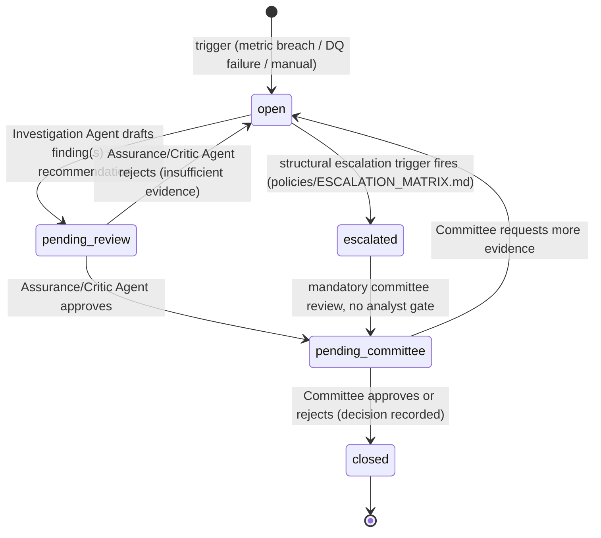

# Governance Schema — Investigation and Evidence Model (Part 6)

**Audience:** Model Risk Architect, Investigation/Assurance agent design owners.
**Table-level detail:** `TABLE_CATALOG.md` Domains 19–26. This file explains the *process model* those tables implement — the state machine an investigation moves through, and how each Part 6 concept (trigger, hypothesis, evidence, finding, root cause, recommendation, decision) is represented.

## 1. Why "store monitoring breaches" is not enough

A table of `(model, metric, breach_date, value)` tells you *that* something happened. It cannot tell you *why*, cannot show competing explanations were considered, and cannot be handed to an auditor as proof that a human reasoned through the evidence rather than rubber-stamping a number. The investigation model exists specifically to carry a breach through hypothesis → evidence → finding → recommendation → decision, with every step queryable afterward.

## 2. Concept-to-table mapping

| Part 6 concept | Table | Notes |
|---|---|---|
| Investigation | `fact_investigation` | The case record |
| Trigger | `fact_investigation.trigger_type` / `trigger_metric_sk` / `trigger_description` | Not a separate table — a trigger is a property of the investigation it opened, because an investigation cannot exist without exactly one triggering event in this design |
| Hypothesis | *Not a persisted table* — hypotheses are working state inside the Investigation Agent's reasoning, only persisted once they become a `fact_finding` (accepted) or are explicitly logged as a rejected hypothesis in `fact_evidence_item.conclusion_supported` with `is_contradictory = true` evidence attached | A hypothesis that never accumulates supporting evidence simply doesn't produce a finding row — this is deliberate: we don't want a permanent table of every idle guess, only of guesses that were evidence-tested |
| Evidence item | `fact_evidence_item` | Single structure for all evidence, ADR-008 |
| Evidence source | `fact_evidence_item.evidence_type` + `source_table` / `tool_execution_id` / `policy_clause_id` | Typed union, not a separate table |
| Evidence lineage | `fact_evidence_item.source_row_identifier` (points into `TABLE_CATALOG.md` domain tables) + `fact_feature_lineage` (for feature-level evidence) | |
| Finding | `fact_finding` | |
| Root cause | `dim_root_cause_taxonomy` + `fact_finding.root_cause_code` | Controlled vocabulary, not free text |
| Contributing factor | `fact_finding_contributing_factor` | One finding, many factors, each weighted |
| Counter-evidence | `fact_evidence_item.is_contradictory = true`, linked via `fact_finding_evidence_link.link_role = 'contradictory'` | Not optional — the Assurance Agent checks that at least one counter-evidence search was attempted, per `agents/ASSURANCE_AGENT.md` |
| Severity | `fact_investigation.severity`, `fact_finding.severity` | Independently settable at trigger time and at finding time (a low-severity trigger can turn out to be a high-severity finding, and vice versa) |
| Recommendation | `fact_recommendation` | |
| Critic review | `fact_finding.critic_review_status` / `critic_review_notes`, `fact_agent_evaluation` (evaluation_type = 'critic_review') | |
| Human decision | `fact_committee_decision`, `fact_human_approval` | |
| Remediation action | `fact_remediation_action` | |
| Closure evidence | `fact_remediation_action.closure_evidence_item_id` → `fact_evidence_item` | Completion is itself evidence-backed, not a checkbox |

## 3. Investigation state machine

No transition into `closed` is possible without a `decision_id` populated (ADR-005). No transition from `open` to `pending_committee` skips `pending_review` — the critic loop is mandatory, not optional, for every investigation regardless of severity.

## 4. Evidence ledger requirements (recap, full field spec in TABLE_CATALOG.md Domain 22)

An evidence item must support: metric value, table and row identifier, tool call, timestamp, policy clause, policy version, agent that used it, conclusion supported, confidence, contradictory evidence. Every one of these is a named field on `fact_evidence_item` or reachable through its typed FKs (`tool_execution_id` → `fact_tool_execution_log` → `dim_tool`; `policy_clause_id` → `dim_policy_clause` → `dim_policy_document.version_label`). There is no free-text-only evidence path in this schema — even a qualitative observation must be typed and attributed.

## 5. Worked example

The full engineered investigation — "Credit Card Behaviour Score PSI became Amber in June," three linked causes, complete data trace from breach to committee decision — is documented in `scenarios/SCENARIO-001-psi-breach.md`. That file is the canonical demonstration of every mechanism described above and is the primary artifact used in the SAS Innovate demo (`demo/DEMO_SCRIPT.md`).
