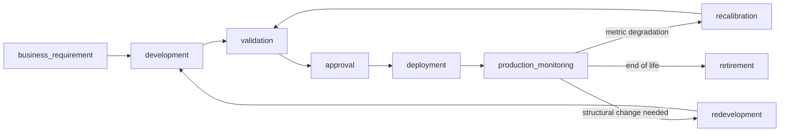

# Model Inventory and Lifecycle Registry (Part 4)

**Audience:** Model Risk Committee, model owners, Governance Agent design owner.
**Distinction from a plain inventory:** this registry tracks *lifecycle stage*, not just "the model exists." Every row in `dim_model` carries a `lifecycle_stage`; transitions between stages are themselves governed events (see §2).

## 1. Lifecycle stages

| Stage | Definition | Who owns the transition out |
|---|---|---|
| `business_requirement` | Business case documented, not yet built | Model Owner |
| `development` | Model being trained/tuned | Model Development Team |
| `validation` | Independent validation in progress | Model Validation Team |
| `approval` | Validated, awaiting Model Risk Committee sign-off | Model Risk Committee |
| `deployment` | Approved, being deployed to production endpoint | Copilot Studio / MLOps engineering |
| `production_monitoring` | Live, being monitored by AI Assurance | Retail Risk Analytics (Monitoring Agent operates here) |
| `recalibration` | Monitoring detected degradation correctable by parameter/threshold re-tuning without full redevelopment | Model Development Team, expedited validation |
| `redevelopment` | Degradation requires a new model generation | Model Development Team, full validation cycle |
| `retirement` | Superseded or discontinued; `dim_model.status = 'retired'`, `successor_model_version_id` populated | Model Risk Committee |

Only `production_monitoring` is in AI Assurance's live operating scope for MVP (per `SCOPE.md`); all other stages are represented structurally in `dim_model`/`dim_model_version` so the schema doesn't need to change when the enterprise build adds active recalibration/redevelopment workflows.

## 2. The twelve model inventory rows

MVP populates `CC-BSCORE` with a full deployment and monitoring history. The remaining eleven rows exist in `dim_model`/`dim_model_version` as registry entries (lifecycle stage, ownership, policy mapping) to prove the schema generalizes, but carry no live monitoring data in MVP — see `SCOPE.md`.

### Credit Card

| Field | Application Score | Behaviour Score **(MVP live)** | Bucket 0 C Score | Bucket 1 C Score |
|---|---|---|---|---|
| `model_id` | `CC-ASCORE` | `CC-BSCORE` | `CC-CSCORE-B0` | `CC-CSCORE-B1` |
| `model_version` | v1.4 | **v2.1** | v1.0 | v1.0 |
| `product` | Credit Card | Credit Card | Credit Card | Credit Card |
| `model_family` | A | B | C | C |
| `model_subtype` | — | — | bucket_0 (1–29 DPD) | bucket_1 (30–59 DPD) |
| `observation_unit` | application | monthly account snapshot | monthly snapshot, bucket 0 accounts | monthly snapshot, bucket 1 accounts |
| `eligibility_rule` | decisioned application | `mob >= 6 AND account_status = 'active'` | `delinquency_bucket_id = 0` | `delinquency_bucket_id = 1` |
| `exclusion_rule` | fraud-flagged applications | closed/charged-off accounts | restructured accounts in current month | restructured accounts in current month |
| `target_definition` | 12-month bad (governed `bad_definition_id`) | 6-month bad | cure vs. roll-forward within 3 months | cure vs. roll-forward/NPL within 3 months |
| `performance_horizon` | 3/6/12 months | 3/6/12 months | 3 months | 3 months |
| `monitoring_frequency` | monthly (population accrues as applications flow) | **monthly** | monthly | monthly |
| `feature_set_version` | FS-CC-A-v09 | **FS-CC-B-v14** | FS-CC-C0-v03 | FS-CC-C1-v03 |
| `algorithm` | logistic regression | **gradient boosted trees** | gradient boosted trees | gradient boosted trees |
| `model_owner` | Retail Risk Analytics | **Retail Risk Analytics** | Collections Analytics | Collections Analytics |
| `validator` | Model Validation Team | **Model Validation Team** | Model Validation Team | Model Validation Team |
| `approver` | Model Risk Committee | **Model Risk Committee** | Model Risk Committee | Model Risk Committee |
| `materiality_tier` | tier_1 | **tier_1** | tier_2 | tier_1 |
| `validation_date` | 2025-03-10 | **2025-09-15** | 2025-05-20 | 2025-05-20 |
| `next_review_date` | 2027-03-10 | **2026-09-15** | 2026-05-20 | 2026-05-20 |
| `deployment_environment` | production (registry only, MVP) | **production (live, MVP)** | production (registry only) | production (registry only) |
| `production_endpoint` | `scoring-api/cc-ascore/v1_4` | **`scoring-api/cc-bscore/v2_1`** | `scoring-api/cc-cscore-b0/v1_0` | `scoring-api/cc-cscore-b1/v1_0` |
| `status` | active | **active** | active | active |
| `predecessor_model` | CC-ASCORE-v1.3 | CC-BSCORE-v2.0 | — | — |
| `successor_model` | — | — | — | — |
| `challenger_model` | none | **CC-BSCORE-v2.2 (shadow)** | none | none |
| `policy_mapping` | POL-MMP-2.1 | **POL-MMP-3.2** | POL-MMP-4.1 | POL-MMP-4.1 |
| `threshold_set` | THR-CC-A-01 | **THR-CC-B-01 (PSI_RAG_CC_BSCORE)** | THR-CC-C0-01 | THR-CC-C1-01 |
| `lifecycle_stage` | production_monitoring (registry) | **production_monitoring (live)** | production_monitoring (registry) | production_monitoring (registry) |

### Speedy Cash

| Field | Application Score | Behaviour Score | Bucket 0 C Score | Bucket 1 C Score |
|---|---|---|---|---|
| `model_id` | `SPC-ASCORE` | `SPC-BSCORE` | `SPC-CSCORE-B0` | `SPC-CSCORE-B1` |
| `model_version` | v1.1 | v1.3 | v1.0 | v1.0 |
| `product` | Speedy Cash | Speedy Cash | Speedy Cash | Speedy Cash |
| `model_family` | A | B | C | C |
| `observation_unit` | application | monthly snapshot | monthly snapshot, bucket 0 | monthly snapshot, bucket 1 |
| `eligibility_rule` | decisioned application | `mob >= 6 AND account_status = 'active'` | `delinquency_bucket_id = 0` | `delinquency_bucket_id = 1` |
| `algorithm` | logistic regression | gradient boosted trees | gradient boosted trees | gradient boosted trees |
| `model_owner` | Retail Risk Analytics | Retail Risk Analytics | Collections Analytics | Collections Analytics |
| `materiality_tier` | tier_2 | tier_2 | tier_2 | tier_2 |
| `status` | active (registry only, no MVP data) | active (registry only) | active (registry only) | active (registry only) |
| `lifecycle_stage` | production_monitoring (registry) | production_monitoring (registry) | production_monitoring (registry) | production_monitoring (registry) |

### Speedy Loan

| Field | Application Score | Behaviour Score | Bucket 0 C Score | Bucket 1 C Score |
|---|---|---|---|---|
| `model_id` | `SPL-ASCORE` | `SPL-BSCORE` | `SPL-CSCORE-B0` | `SPL-CSCORE-B1` |
| `model_version` | v1.0 | v1.0 | v1.0 | v1.0 |
| `product` | Speedy Loan | Speedy Loan | Speedy Loan | Speedy Loan |
| `model_family` | A | B | C | C |
| `observation_unit` | application | monthly snapshot | monthly snapshot, bucket 0 | monthly snapshot, bucket 1 |
| `eligibility_rule` | decisioned application | `mob >= 6 AND account_status = 'active'` (additionally excludes accounts within final `remaining_tenor_months < 1`, see near-maturity handling in `TEMPORAL_MODEL.md` §7.5) | `delinquency_bucket_id = 0` | `delinquency_bucket_id = 1` |
| `algorithm` | logistic regression | gradient boosted trees | gradient boosted trees | gradient boosted trees |
| `model_owner` | Retail Risk Analytics | Retail Risk Analytics | Collections Analytics | Collections Analytics |
| `materiality_tier` | tier_2 | tier_2 | tier_2 | tier_1 |
| `status` | active (registry only) | active (registry only) | active (registry only) | active (registry only) |
| `lifecycle_stage` | production_monitoring (registry) | production_monitoring (registry) | production_monitoring (registry) | production_monitoring (registry) |

## 3. Why only `CC-BSCORE` carries live deployment/monitoring rows in MVP

`fact_model_deployment` and `fact_monitoring_metric` are populated only for `CC-BSCORE-v2.1` — the other eleven model versions exist in `dim_model`/`dim_model_version` (proving the registry schema handles all twelve) but have **no synthetic score events, no monitoring runs**. This is the exact MVP/enterprise boundary described in `SCOPE.md` and `MVP_VS_ENTERPRISE.md`: the schema supports twelve models identically; the demo populates one.
